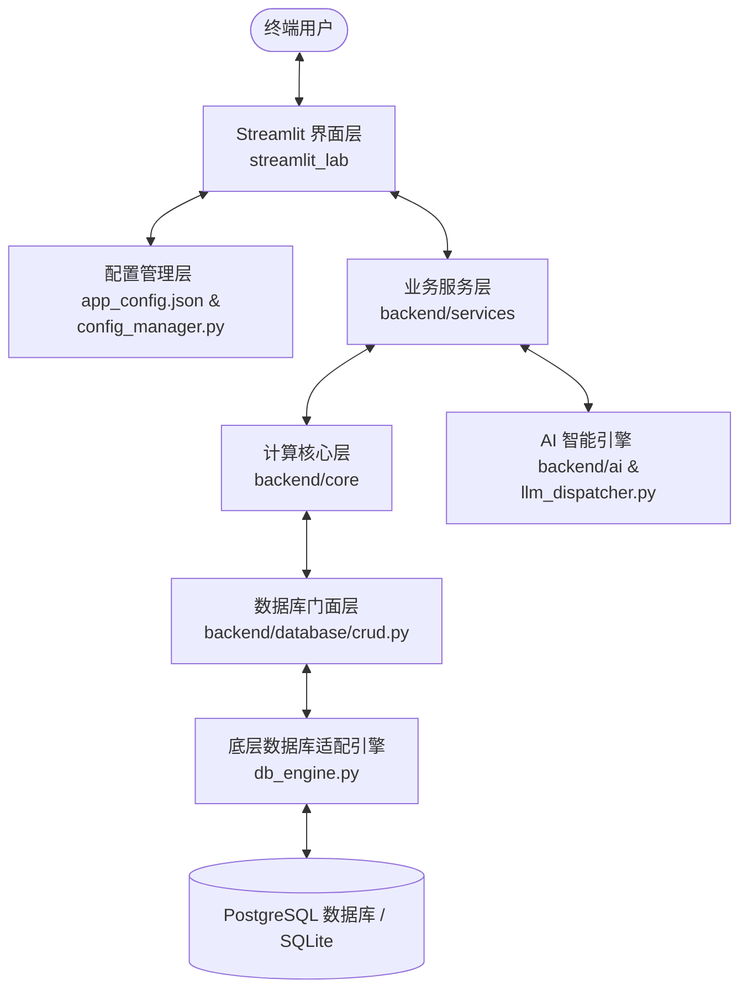

# 🏗️ ERP V2 (PostgreSQL 版) 系统架构及目录结构指南

为了帮助用户及非专业开发团队快速理解本系统的代码组织方式，本架构文档以**业务模块**和**组件用途**为核心，梳理了当前阶段代码库中所有的文件夹及关键文件的具体作用。

---

## 🧭 全局架构与数据流向

本系统采用 **Streamlit 纯 Python 驱动的轻量化前后端同构架构**，配合关系型数据库进行持久化。系统的核心运作可以分为以下几层：



- **配置驱动（灵魂）**：所有的合同类型、字段规则（包括字段类型、是否只读、AI 提取规则、展示排序等）均定义在 [app_config.json](file:///e:/developer/ERP_V2_Postgres/app_config.json) 中。修改此配置文件，底层的数据库结构及前端的输入表单将会**同步自动扩容/调整**，无需手动修改代码。
- **数据流向**：前端 Streamlit 接收用户操作，调用 `backend/services` 下的相应逻辑模块，完成财务核算、AI 合同智能识别或数据导入清洗，最后经由 `backend/database/crud.py` 进行持久化存储。

---

## 📂 项目目录树与注释说明

以下是系统当前版本的完整目录树结构及其对应组件用途说明：

```text
.
├── backend/                           # 后端核心逻辑与业务引擎目录
│   ├── ai/                            # AI 模型适配层
│   │   └── llm_dispatcher.py          # AI 调度器：支持云端/本地大模型接口转发与调用分发
│   ├── api/                           # 路由接口层
│   │   └── ai_router.py               # AI 提取接口定义（预留）
│   ├── config/                        # 系统配置控制中心
│   │   ├── config_manager.py          # 动态模型规则包加载与保存，表头映射自动对齐
│   │   └── settings.py                # 强类型环境变量校验器 (Pydantic Settings)
│   ├── core/                          # 基础计算与系统点火引擎
│   │   ├── bootstrap.py               # 系统冷启动：物理目录预建、运行环境 Fail-Fast 预检
│   │   ├── business_ops.py            # 项目计提标记与跨年归档等通用核心业务行为
│   │   ├── core_logic.py              # 公式运行器：使用 Pandas 动态计算 JSON 配置的业务公式
│   │   └── finance_engine.py          # 财务引擎：计算回款开票额、防范超付的分包背靠背限额
│   ├── database/                      # 数据库底层持久化层
│   │   ├── db_engine.py               # 多数据库驱动与 SQL 适配器 (支持 Postgres & SQLite)
│   │   ├── schema.py                  # 表结构热更新同步引擎：自动根据配置物理扩容字段
│   │   ├── custom_schema.py           # 契约/财务/流水/保证金/分包出款等专属物理表 DDL
│   │   ├── crud.py                    # 数据库操作 Facade 统一门面
│   │   ├── crud_base.py               # 底层通用增删改查、业务唯一编号 biz_code 生成
│   │   ├── crud_finance.py            # 分包付款、合同状态及计提相关的专属持久化接口
│   │   └── crud_sys.py                # 回收站、审计日志和附件关联的专属持久化接口
│   ├── observability/                 # 可观测性监控
│   │   └── logger.py                  # 系统日志管理与输出轮转配置
│   ├── services/                      # 基础服务业务层
│   │   ├── ai_service.py              # AI 合同内容动态过滤与智能结构化数据抽取
│   │   ├── analysis_service.py        # 数据统计：提供全局毛利、现金流及税务敞口计算
│   │   ├── auth_service.py            # 用户安全认证：哈希加密、登录校验与账号状态控制
│   │   ├── dashboard_service.py       # 大屏看板数据指标及动态收集服务
│   │   ├── excel_service.py           # 智能 Excel 导入清洗、表头定位和前向填充
│   │   ├── export_service.py          # PG JSONB 数据转 Excel/CSV 导出防爆助手
│   │   ├── file_service.py            # 附件物理落地物理存储与关联注册登记
│   │   ├── flow_service.py            # 收付款流水明细账簿管理与汇总同步重算
│   │   └── project_service.py         # 级联更新模块：修改项目编号时级联更新表及附件文件夹
│   └── utils/                         # 后端辅助工具库
│       └── formatters.py              # 日期/数值等格式通用清洗转换
├── data/                              # 本地数据与附件物理挂载点
│   ├── backups/                       # 数据库备份文件存放目录
│   └── uploads/                       # 附件上传的物理目录
├── streamlit_lab/                     # 前端 Streamlit 交互与渲染层目录
│   ├── app.py                         # 系统大屏首页：展示 KPI 指标、趋势图及近期动态
│   ├── components.py                  # UI 公共组件工厂：动态表单渲染、时光机审计日志时间轴等
│   ├── debug_kit.py                   # 开发者调试工具：在线改配置热重载、直连 SQL 终端
│   ├── sidebar_manager.py             # 侧边栏全局控制：链接配置、开发者开关、版本标注
│   ├── experiments/                   # 冗余/备用实验性组件 (不挂载在常规侧边栏菜单)
│   │   ├── ex01_risk_engine.py        # 实验性合同风险测评系统
│   │   └── ex02_main_contract_custom.py # 实验性前端表单拖拽自适应布局
│   └── pages/                         # 独立菜单功能页面目录
│       ├── 01_📂_项目看板.py           # 项目各生命周期进度看板矩阵页
│       ├── 02_🛠️_主合同管理.py          # 主合同增删改查、AI提取、附件及时光机详情页
│       ├── 03_🛠️_分包合同管理.py        # 分包合同付款流水记账及背靠背付款校验页
│       ├── 04_📊_数据分析.py           # 全局利润、双向现金流与税务可视化报表页
│       ├── 05_🏢_往来单位.py           # 外部协作单位黄页名录维护页
│       ├── 06_📥_导入Excel.py          # 数据智能向导映射导入界面页
│       ├── 07_⚙️_系统管理.py           # 员工角色分配、状态封禁与密码修改页
│       └── 99_🧪_实验室.py             # 沙盒测试隐藏主入口页
├── wheels/                            # 本地 Wheel 包目录 (用于完全离线状态下安装环境依赖)
├── app_config.json                    # 全局元数据规则核心配置（控制全物理建表、公式计算及渲染）
├── .env.example                       # 环境变量模板
├── docker-compose.yml                 # 离线部署 Docker 容器编排文件
├── Dockerfile                         # Web 容器映像构建规范
└── requirements.txt                   # 三方依赖清单
```

---

## 🔗 核心组件及文件直达链接

为了方便在代码编辑器中一键直达对应文件，下面列出了系统最核心的组件：

### ⚙️ 全局配置与环境

- 核心元配置数据: [app_config.json](file:///e:/developer/ERP_V2_Postgres/app_config.json)
- 配置同步管理器: [backend/config/config_manager.py](file:///e:/developer/ERP_V2_Postgres/backend/config/config_manager.py)
- 系统环境与秘钥校验: [backend/config/settings.py](file:///e:/developer/ERP_V2_Postgres/backend/config/settings.py)
- 环境配置模板: [.env.example](file:///e:/developer/ERP_V2_Postgres/.env.example)

### 🏗️ 后端核心与计算引擎

- 物理表动态扩容模块: [backend/database/schema.py](file:///e:/developer/ERP_V2_Postgres/backend/database/schema.py)
- 多库及适配引擎: [backend/database/db_engine.py](file:///e:/developer/ERP_V2_Postgres/backend/database/db_engine.py)
- 财务指标计算引擎: [backend/core/finance_engine.py](file:///e:/developer/ERP_V2_Postgres/backend/core/finance_engine.py)
- 动态公式解析引擎: [backend/core/core_logic.py](file:///e:/developer/ERP_V2_Postgres/backend/core/core_logic.py)
- 系统点火与自检: [backend/core/bootstrap.py](file:///e:/developer/ERP_V2_Postgres/backend/core/bootstrap.py)

### 💾 业务数据操作与服务

- 数据库操作总门面: [backend/database/crud.py](file:///e:/developer/ERP_V2_Postgres/backend/database/crud.py)
- 专属物理表 DDL 定义: [backend/database/custom_schema.py](file:///e:/developer/ERP_V2_Postgres/backend/database/custom_schema.py)
- AI 智能合同条款提取服务: [backend/services/ai_service.py](file:///e:/developer/ERP_V2_Postgres/backend/services/ai_service.py)
- 往来收付资金记账服务: [backend/services/flow_service.py](file:///e:/developer/ERP_V2_Postgres/backend/services/flow_service.py)
- Excel 导入清洗服务: [backend/services/excel_service.py](file:///e:/developer/ERP_V2_Postgres/backend/services/excel_service.py)
- 物理附件保存归档服务: [backend/services/file_service.py](file:///e:/developer/ERP_V2_Postgres/backend/services/file_service.py)
- 项目级联更新服务: [backend/services/project_service.py](file:///e:/developer/ERP_V2_Postgres/backend/services/project_service.py)

### 🖥️ 前端 Streamlit 界面层

- 首页及 KPI 大屏汇总: [streamlit_lab/app.py](file:///e:/developer/ERP_V2_Postgres/streamlit_lab/app.py)
- 动态表单及时光机组件库: [streamlit_lab/components.py](file:///e:/developer/ERP_V2_Postgres/streamlit_lab/components.py)
- 侧边栏导航控制: [streamlit_lab/sidebar_manager.py](file:///e:/developer/ERP_V2_Postgres/streamlit_lab/sidebar_manager.py)
- 在线改配置与 SQL 终端: [streamlit_lab/debug_kit.py](file:///e:/developer/ERP_V2_Postgres/streamlit_lab/debug_kit.py)

### 📂 主要业务功能网页

- 主合同业务管理页: [主合同管理.py](file:///e:/developer/ERP_V2_Postgres/streamlit_lab/pages/02_🛠️_主合同管理.py)
- 分包及背靠背限额管理页: [分包合同管理.py](file:///e:/developer/ERP_V2_Postgres/streamlit_lab/pages/03_🛠️_分包合同管理.py)
- 利润及现金流可视化分析页: [数据分析.py](file:///e:/developer/ERP_V2_Postgres/streamlit_lab/pages/04_📊_数据分析.py)
- 关联协作单位黄页页: [往来单位.py](file:///e:/developer/ERP_V2_Postgres/streamlit_lab/pages/05_🏢_往来单位.py)
- 映射式数据导入页: [导入Excel.py](file:///e:/developer/ERP_V2_Postgres/streamlit_lab/pages/06_📥_导入Excel.py)
